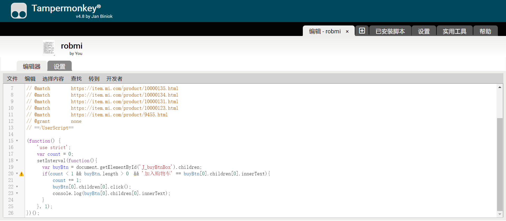
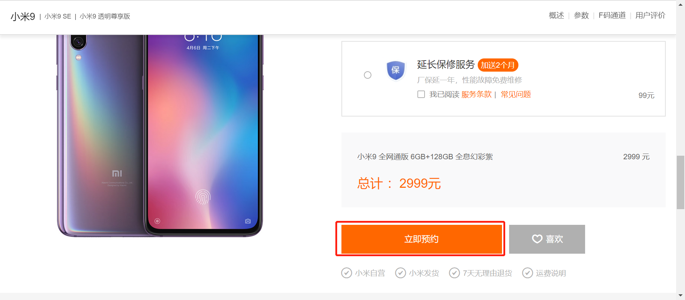
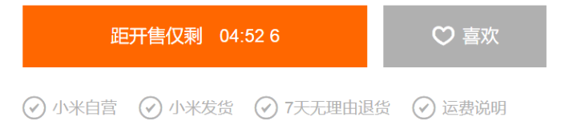

# robmi
抢小米手机

## 前言
抢不到小米，写了点代码，以每秒1000次的速度点击加入购物车。

## 一.代码部署
1.浏览器安装油猴插件（Tampermonkey）或暴力猴插件(Violentmonkey) 
2.新建一个脚本，把main.js里的代码拷进去 
 
3.复制小米购买页面的地址，找一条@match代码把后面地址替换掉（如已有复制了的地址，忽略此操作）如： 
// @match        https://item.mi.com/product/10000131.html

## 二.小米官网操作
1.登录小米账号 
2.找到要抢的小米型号，点击立即预约 

3.抢购时提前访问小米官网并登录账号，点开购买页面，这时按钮显示倒计时 

4.选择自己需要的版本、颜色、套餐等，然后等待倒计时结束，不需要任何操作，代码自动把手机添加到购物车 

5.进入购物车后赶紧去结算
